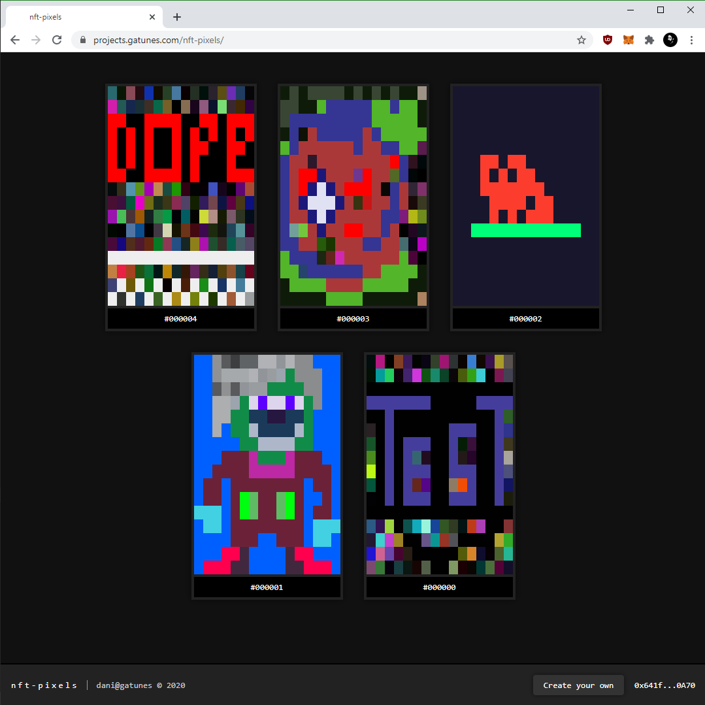

nft-pixels
==



#### Local development

```bash
# clone this repo
git clone https://github.com/danielesteban/nft-pixels.git
cd nft-pixels
# install dependencies
npm install
# start local blockchain:
npm run ganache
# once started, copy & import a "private key" to your wallet

# from another terminal,
# deploy the contract & start the client:
npm run migrate
npm start
```
